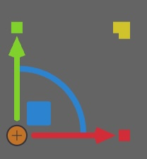
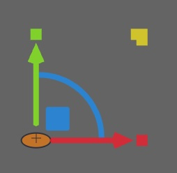

# MovablePoint circle markers distort at extreme canvas zoom

## Context

While testing the fix for `issue-019f2ded` (resolved: transform gizmo
distortion at extreme zoom, [PR #89](https://github.com/earlye/friction/pull/89)),
the user reproduced a visually similar distortion in the **rotation
pivot marker itself** (the small circle-with-a-plus drawn at the
gizmo's origin) — this is *not* part of the fixed gizmo code.

In box-transform mode, zoomed in extremely on the gizmo (viewport
positioned away from visible artwork, near the SVG's local `0,0` / the
box's pivot), the pivot's circle marker stretched into an oval instead
of staying circular. Confirmed via screenshots below: the first shows
a circular orange marker with a `+` inside; the second shows the same
marker stretched into an oval, with other gizmo handles' relative
positions/sizes also visibly shifted.

| Normal | Distorted |
| --- | --- |
|  |  |

## Root cause (fixed)

`PathPivot::drawSk` (`src/core/MovablePoints/pathpivot.cpp:39-63`)
calls `MovablePoint::drawOnAbsPosSk`
(`src/core/MovablePoints/movablepoint.cpp:83-120`), which computes:

```cpp
const float scaledRadius = static_cast<float>(mRadius)*invScale;
canvas->drawCircle(absPos, scaledRadius, paint);
```

`absPos` is the absolute world-space point (narrowed via `toSkPoint`
from the double-precision `getAbsolutePos()`); `scaledRadius` is
`pixelConstant * invScale`, computed and narrowed to float32
separately from `absPos`. This is the same class of bug fixed in
`issue-019f2ded` (`canvasgizmos.cpp`): `canvas->drawCircle`'s internal
bounds construction (`absPos ± scaledRadius`) happens in
`SkScalar`/float32 arithmetic, and at extreme zoom (tiny `invScale`)
that addition/subtraction can lose precision asymmetrically between
the x and y axes, stretching the circle into an oval rather than
shattering it outright the way the gizmo's polygon vertices did. This
still runs under the canvas's concatenated world-to-device zoom
transform (`canvas->concat(skViewTrans)` in `canvas.cpp`, never reset
before this draw call) — the same architectural pattern the gizmo fix
replaced with screen-space drawing.

**Scope/impact is broader than just the pivot**: `drawOnAbsPosSk` is
also called from `src/core/MovablePoints/boxpathpoint.cpp:65`,
`smartctrlpoint.cpp:53`, and `smartnodepoint.cpp:295,327` — meaning
this same distortion likely affects every path node and control point
rendered on the canvas, not just the rotation pivot marker.
`MovablePoint::drawHovered` (`movablepoint.cpp:49-62`) uses the same
`absPos`/`invScale`-radius pattern via `canvas->drawCircle` too and is
likely equally affected, though not visually confirmed.

This was already flagged, unconfirmed, as
`mRotPivot->drawTransforming(...)/drawSk(...)` in the sibling-overlay
follow-up issue
(`issue-019f38d7-6df9-7aa0-8f22-ffdd43a7997b-sibling-overlay-invzoom-precision.md`)
filed alongside PR #89 — but that entry didn't know about the broader
`MovablePoint::drawOnAbsPosSk` blast radius (path nodes, control
points) or have reproduction evidence. Tracking this as its own
separate issue rather than folding it into that one, since it's now
confirmed (not just pattern-matched) and has much wider impact than a
single overlay widget.

**Likely fix direction** (by analogy to `issue-019f2ded`'s
resolution): draw these circles in device/screen space instead of
world space — project the point once via the canvas's total matrix,
then use a raw pixel-constant radius (scaled only by
`devicePixelRatio`, no `invScale`) rather than `invScale`-derived
world-space geometry narrowed to float32.

## Relevant files

- `src/core/MovablePoints/movablepoint.cpp:83-120` — `drawOnAbsPosSk` (root cause), and `drawHovered` (`movablepoint.cpp:49-62`, same pattern, unconfirmed)
- `src/core/MovablePoints/pathpivot.cpp:39-63` — `PathPivot::drawSk`, the specific call site reproduced in screenshots
- `src/core/MovablePoints/boxpathpoint.cpp:65` — another caller of `drawOnAbsPosSk`
- `src/core/MovablePoints/smartctrlpoint.cpp:53` — another caller
- `src/core/MovablePoints/smartnodepoint.cpp:295,327` — another caller
- `src/core/canvasgizmos.cpp` — the resolved gizmo fix (`issue-019f2ded`), useful as a reference implementation for the screen-space pattern
- `issues/issue-019f3d32-cdd9-7052-b37a-f48a666431f6-movablepoint-circle-precision-loss-normal.jpg` / `-distorted.jpg` — screenshots demonstrating the bug (copied from the main repo root, where the user originally saved them)

## Resolution

Fixed by projecting the point once through the canvas's current total
matrix (`canvas->getTotalMatrix().mapPoints(...)`), then drawing
entirely in device/screen space with a radius derived as `invScale *
matrix-scale` — no dependency on the absolute position's magnitude at
all, matching `issue-019f2ded`'s screen-space pattern. Since the fix
lives in the shared `MovablePoint::drawOnAbsPosSk`/`drawHovered`
functions, it covers every caller (pivot, path nodes, control points)
without needing separate reproduction at each site. `git blame` traced
this to pre-existing upstream code (predates the fork).

A Skia-independent unit test (`tests/tst_movablepoint_precision.cpp`,
mirroring `tst_gizmos.cpp`'s pattern) characterizes the float32
bounds-construction bug and confirms the fix's approach doesn't
reproduce it — though it does not link/exercise `movablepoint.cpp`
itself, since the actual precision loss lives inside Skia's own
`SkCanvas::drawCircle`, not in project code that can be tested in
isolation the way the gizmo's shape math was.

**Known remaining scope**: `GradientPoint::drawSk`
(`src/core/MovablePoints/gradientpoint.cpp:46-65`) reimplements the
same world-space `drawCircle(absPos, radius*invScale)` pattern directly
rather than calling `drawOnAbsPosSk`, so it did not benefit from this
fix and will still distort at extreme zoom. Not fixed here since it
wasn't part of this issue's confirmed scope (rotation pivot, path
nodes, control points) — worth a follow-up if gradient handles are
confirmed affected.
